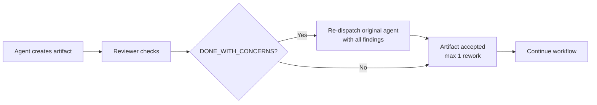
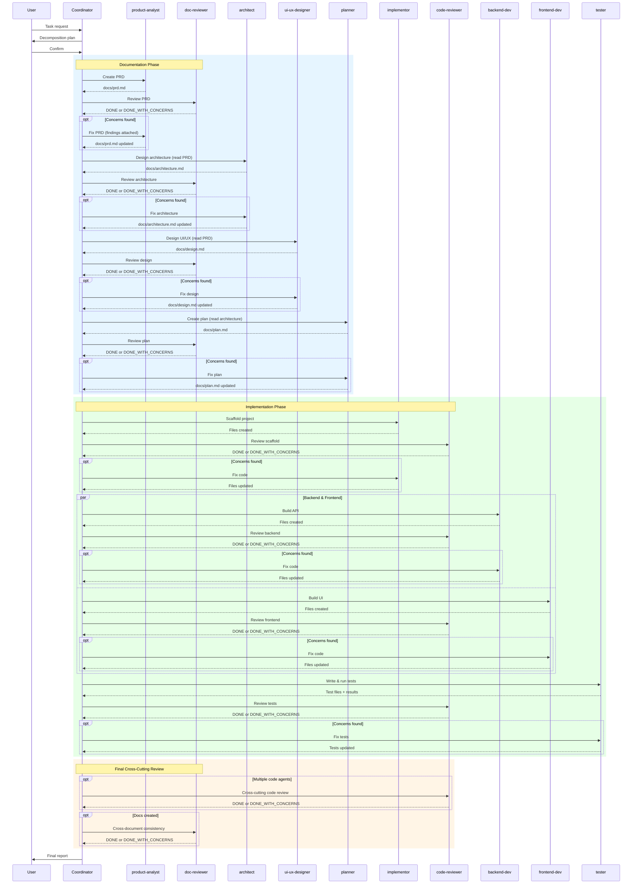
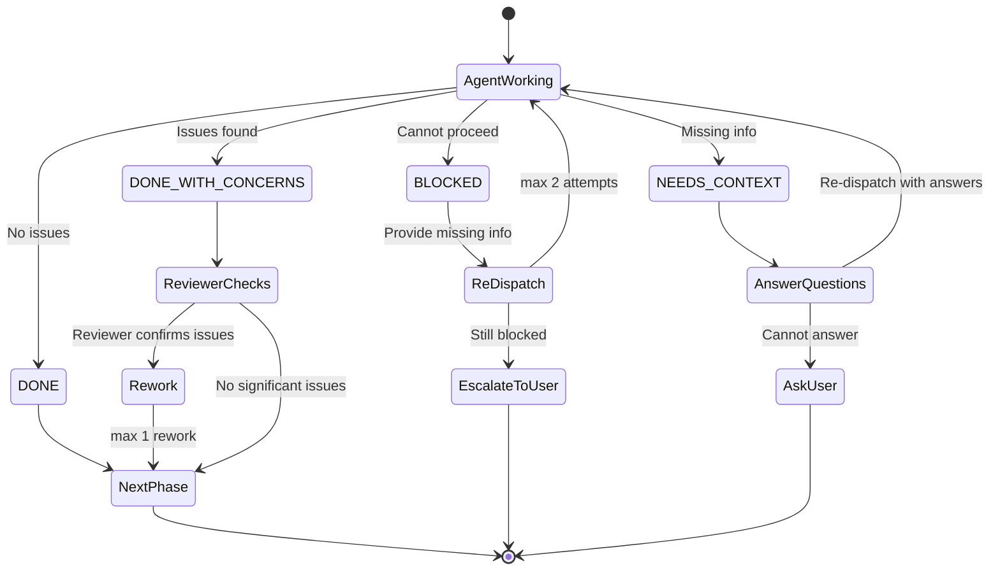

# Dev-Team Workflow

## Overview

The dev-team plugin follows a 5-phase coordinator + specialists architecture. Documents and code are reviewed inline — every artifact is validated immediately after creation, and reworked if issues are found (max 1 rework cycle per artifact to prevent loops).

## Full Workflow (Greenfield)

```mermaid
flowchart TD
    START([User Request]) --> P1

    subgraph P1["Phase 1: Analysis"]
        A1[Parse task & detect stack]
        A2[Identify agents & decompose subtasks]
        A3[Present plan to user]
        A1 --> A2 --> A3
    end

    P1 --> CONFIRM{User confirms?}
    CONFIRM -- No --> P1
    CONFIRM -- Yes --> P2

    subgraph P2["Phase 2: Dispatch & Inline Review"]
        direction TB

        subgraph DOC_PHASE["Documentation Phase"]
            direction TB

            PA[product-analyst] -->|docs/prd.md| DR1
            subgraph DR1["Doc Review: PRD"]
                DR1_R[doc-reviewer]
                DR1_D{Concerns?}
                DR1_R --> DR1_D
                DR1_D -- Yes --> DR1_FIX[re-dispatch product-analyst]
                DR1_FIX --> DR1_OK[PRD ready]
                DR1_D -- No --> DR1_OK
            end

            DR1 --> ARCH[architect]
            ARCH -->|docs/architecture.md| DR2
            subgraph DR2["Doc Review: Architecture"]
                DR2_R[doc-reviewer]
                DR2_D{Concerns?}
                DR2_R --> DR2_D
                DR2_D -- Yes --> DR2_FIX[re-dispatch architect]
                DR2_FIX --> DR2_OK[Architecture ready]
                DR2_D -- No --> DR2_OK
            end

            DR2 --> UI[ui-ux-designer]
            UI -->|docs/design.md| DR3
            subgraph DR3["Doc Review: Design"]
                DR3_R[doc-reviewer]
                DR3_D{Concerns?}
                DR3_R --> DR3_D
                DR3_D -- Yes --> DR3_FIX[re-dispatch ui-ux-designer]
                DR3_FIX --> DR3_OK[Design ready]
                DR3_D -- No --> DR3_OK
            end

            DR3 --> PL[planner]
            PL -->|docs/plan.md| DR4
            subgraph DR4["Doc Review: Plan"]
                DR4_R[doc-reviewer]
                DR4_D{Concerns?}
                DR4_R --> DR4_D
                DR4_D -- Yes --> DR4_FIX[re-dispatch planner]
                DR4_FIX --> DR4_OK[Plan ready]
                DR4_D -- No --> DR4_OK
            end
        end

        DOC_PHASE --> CODE_PHASE

        subgraph CODE_PHASE["Implementation Phase"]
            direction TB

            IMP[implementor: scaffolding] --> CR1
            subgraph CR1["Code Review: Scaffold"]
                CR1_R[code-reviewer]
                CR1_D{Concerns?}
                CR1_R --> CR1_D
                CR1_D -- Yes --> CR1_FIX[re-dispatch implementor]
                CR1_FIX --> CR1_OK[Scaffold ready]
                CR1_D -- No --> CR1_OK
            end

            CR1 --> PARALLEL

            subgraph PARALLEL["Parallel Dispatch"]
                direction LR
                BE[backend-dev] --> CR2
                subgraph CR2["Code Review"]
                    CR2_R[code-reviewer]
                    CR2_D{Concerns?}
                    CR2_R --> CR2_D
                    CR2_D -- Yes --> CR2_FIX[re-dispatch backend-dev]
                    CR2_FIX --> CR2_OK[Backend ready]
                    CR2_D -- No --> CR2_OK
                end

                FE[frontend-dev] --> CR3
                subgraph CR3["Code Review"]
                    CR3_R[code-reviewer]
                    CR3_D{Concerns?}
                    CR3_R --> CR3_D
                    CR3_D -- Yes --> CR3_FIX[re-dispatch frontend-dev]
                    CR3_FIX --> CR3_OK[Frontend ready]
                    CR3_D -- No --> CR3_OK
                end
            end

            PARALLEL --> TEST[tester]
            TEST --> CR4
            subgraph CR4["Code Review: Tests"]
                CR4_R[code-reviewer]
                CR4_D{Concerns?}
                CR4_R --> CR4_D
                CR4_D -- Yes --> CR4_FIX[re-dispatch tester]
                CR4_FIX --> CR4_OK[Tests ready]
                CR4_D -- No --> CR4_OK
            end
        end
    end

    P2 --> P3

    subgraph P3["Phase 3: Collection"]
        C1[Process agent reports]
        C2{All DONE?}
        C1 --> C2
        C2 -- "BLOCKED / NEEDS_CONTEXT" --> C3[Re-dispatch with info]
        C3 --> C1
        C2 -- Yes --> C4[Proceed]
    end

    P3 --> P4

    subgraph P4["Phase 4: Final Review"]
        direction TB
        F1{Multiple code agents?}
        F1 -- Yes --> F2[code-reviewer: cross-cutting review]
        F2 --> F2D{Concerns?}
        F2D -- Yes --> F2FIX[re-dispatch code agent]
        F2FIX --> F3
        F2D -- No --> F3
        F1 -- No --> F3

        F3{Docs created?}
        F3 -- Yes --> F4[doc-reviewer: cross-doc consistency]
        F4 --> F4D{Concerns?}
        F4D -- Yes --> F4FIX[re-dispatch doc agent]
        F4FIX --> F5[Review complete]
        F4D -- No --> F5
        F3 -- No --> F5
    end

    P4 --> P5

    subgraph P5["Phase 5: Report"]
        R1[Compile summary]
        R2[Files changed + tests + concerns]
        R3[Suggested next steps]
        R1 --> R2 --> R3
    end

    P5 --> DONE([Done])
```

## Review Loop Pattern

Every artifact (document or code) follows the same review-and-rework pattern:

| Artifact type | Creator agents | Reviewer | Rework limit |
|---|---|---|---|
| PRD | product-analyst | doc-reviewer | 1 |
| Architecture | architect | doc-reviewer | 1 |
| Design spec | ui-ux-designer | doc-reviewer | 1 |
| Execution plan | planner | doc-reviewer | 1 |
| Scaffold code | implementor | code-reviewer | 1 |
| Backend code | backend-dev | code-reviewer | 1 |
| Frontend code | frontend-dev | code-reviewer | 1 |
| Test code | tester | code-reviewer | 1 |

## Agent Dispatch Order

## Status Handling

