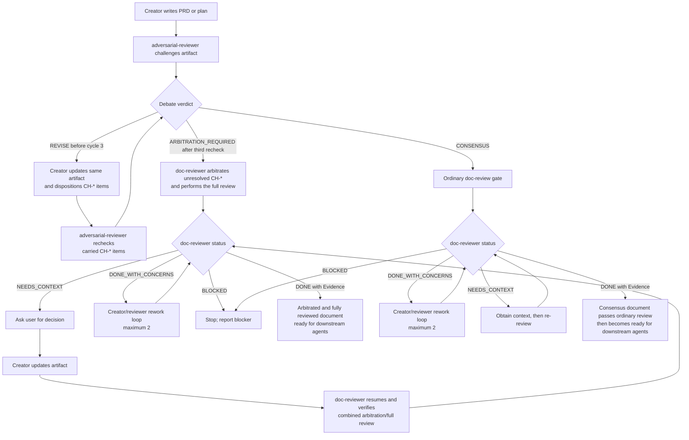
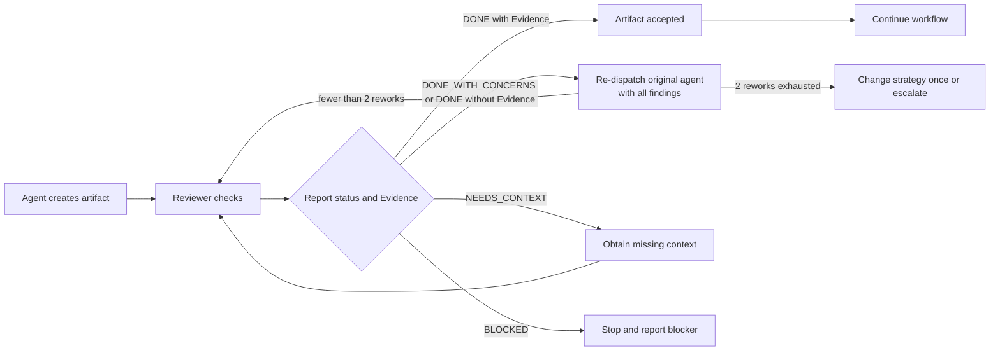
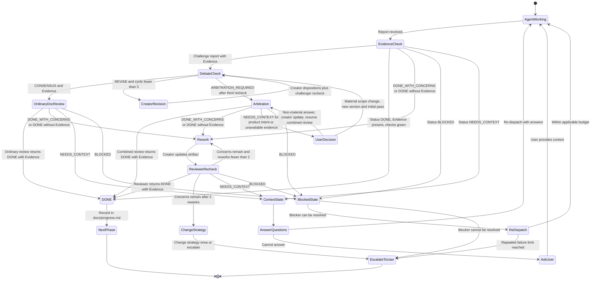

# Dev-Team Workflow

## Overview

The dev-team plugin follows a 5-phase coordinator + specialists architecture. Documents and code are reviewed inline. PRDs and execution plans first pass a mandatory adversarial debate, then either consensus plus ordinary document review or a combined arbitration/full review after an unresolved third recheck. Other artifacts enter their ordinary review gate immediately after creation.

Core disciplines:
- **Evidence gate**: every agent report must contain an `Evidence` field with fresh command output (or file:line citations for read-only agents). A DONE without Evidence is treated as DONE_WITH_CONCERNS.
- **Adversarial planning gate**: `adversarial-reviewer` attacks PRD and plan assumptions, trade-offs, and plausible failure scenarios. The document creator resolves stable `CH-*` challenges; downstream agents receive the document only after consensus plus ordinary review or successful combined arbitration/full review.
- **Separated review duties**: `adversarial-reviewer` performs risk-oriented challenge. `doc-reviewer` checks completeness, consistency, and actionability; after debate cycle 3, it also arbitrates unresolved challenges.
- **Vertical slices**: the planner decomposes into end-to-end user paths (tracer bullet first), mapped to PRD acceptance criterion IDs (AC-001...).
- **Tester-first per slice**: tester Mode A writes failing acceptance tests before implementation; implementation agents make them green (but never touch test files); tester Mode B verifies green and extends coverage.
- **Progress ledger**: the coordinator maintains `docs/progress.md` and re-reads it (plus `docs/prd.md`) at every phase and slice start.

Task-type skill routing (Phase 1):
- **Metric optimization** ("make it faster", "improve the score", tune a measurable number) → implementor dispatched with the `autoresearch` skill: immutable evaluator, one atomic mutation per experiment, keep/discard by metric, every attempt logged.
- **UI tasks** → the coordinator names the aesthetic explicitly (e.g., "premium SaaS", "minimalist editorial") so ui-ux-designer and frontend-dev apply the same `design-styles` preset; the aesthetic name is passed through both dispatches.

## Full Workflow (Greenfield)

```mermaid
flowchart TD
    START([User Request]) --> P1

    subgraph P1["Phase 1: Analysis"]
        A1[Parse task & detect stack]
        A2[Identify agents & decompose subtasks]
        A3[Present plan to user]
        A1 --> A2 --> A3
    end

    P1 --> CONFIRM{User confirms?}
    CONFIRM -- No --> P1
    CONFIRM -- Yes --> LEDGER[Create docs/progress.md]
    LEDGER --> P2

    subgraph P2["Phase 2: Dispatch & Inline Review"]
        direction TB

        subgraph DOC_PHASE["Documentation Phase"]
            direction TB

            PA[product-analyst] -->|docs/prd.md with AC-IDs| ADV1["PRD initial challenge<br/>then max 3 creator/recheck cycles"]
            ADV1 -->|Consensus or arbitration| DR1
            subgraph DR1["Doc Review: PRD"]
                DR1_R[doc-reviewer]
                DR1_D{Concerns?}
                DR1_R --> DR1_D
                DR1_D -- Yes --> DR1_FIX[re-dispatch product-analyst]
                DR1_FIX -->|recheck, max 2 reworks| DR1_R
                DR1_D -- No --> DR1_OK
            end

            DR1 --> ARCH[architect]
            ARCH -->|docs/architecture.md| DR2
            subgraph DR2["Doc Review: Architecture"]
                DR2_R[doc-reviewer]
                DR2_D{Concerns?}
                DR2_R --> DR2_D
                DR2_D -- Yes --> DR2_FIX[re-dispatch architect]
                DR2_FIX -->|recheck, max 2 reworks| DR2_R
                DR2_D -- No --> DR2_OK
            end

            DR2 --> UI[ui-ux-designer]
            UI -->|docs/design.md| DR3
            subgraph DR3["Doc Review: Design"]
                DR3_R[doc-reviewer]
                DR3_D{Concerns?}
                DR3_R --> DR3_D
                DR3_D -- Yes --> DR3_FIX[re-dispatch ui-ux-designer]
                DR3_FIX -->|recheck, max 2 reworks| DR3_R
                DR3_D -- No --> DR3_OK
            end

            DR3 --> PL[planner]
            PL -->|docs/plan.md: vertical slices| ADV4["Plan initial challenge<br/>then max 3 creator/recheck cycles"]
            ADV4 -->|Consensus or arbitration| DR4
            subgraph DR4["Doc Review: Plan"]
                DR4_R[doc-reviewer]
                DR4_D{Concerns?}
                DR4_R --> DR4_D
                DR4_D -- Yes --> DR4_FIX[re-dispatch planner]
                DR4_FIX -->|recheck, max 2 reworks| DR4_R
                DR4_D -- No --> DR4_OK
            end
        end

        DOC_PHASE --> SCAFFOLD

        subgraph SCAFFOLD["Shared Scaffolding"]
            IMP[implementor: skeleton, config, shared types] --> CR1
            subgraph CR1["Code Review: Scaffold"]
                CR1_R[code-reviewer]
                CR1_D{Concerns?}
                CR1_R --> CR1_D
                CR1_D -- Yes --> CR1_FIX[re-dispatch implementor]
                CR1_FIX --> CR1_OK[Scaffold ready]
                CR1_D -- No --> CR1_OK
            end
        end

        SCAFFOLD --> SLICE_LOOP

        subgraph SLICE_LOOP["Per Slice (tracer bullet first)"]
            direction TB
            TA["tester Mode A: failing acceptance tests<br/>(expected-red per AC-ID)"] --> PARALLEL

            subgraph PARALLEL["Parallel Implementation (disjoint scopes)"]
                direction LR
                BE[backend-dev] 
                FE[frontend-dev]
            end

            PARALLEL --> TB2["tester Mode B: full suite green,<br/>extend coverage, update docs/test-plan.md"]
            TB2 --> CRS
            subgraph CRS["Code Review: Slice"]
                CRS_R[code-reviewer]
                CRS_D{Concerns?}
                CRS_R --> CRS_D
                CRS_D -- Yes --> CRS_FIX[re-dispatch responsible agent]
                CRS_FIX --> CRS_OK[Slice done]
                CRS_D -- No --> CRS_OK
            end
            CRS --> GATE{"Slice acceptance tests<br/>pass end-to-end?"}
            GATE -- Yes --> NEXT_SLICE[Next slice]
            GATE -- No --> FIX[re-dispatch within rework limits]
            FIX --> TB2
        end
    end

    P2 --> P3

    subgraph P3["Phase 3: Collection"]
        C0["Evidence gate: DONE without Evidence<br/>= DONE_WITH_CONCERNS"]
        C1[Process agent reports, update docs/progress.md]
        C2{All DONE?}
        C0 --> C1 --> C2
        C2 -- "BLOCKED / NEEDS_CONTEXT" --> C3[Re-dispatch with info]
        C3 --> C1
        C2 -- Yes --> C4[Proceed]
    end

    P3 --> P4

    subgraph P4["Phase 4: Final Review"]
        direction TB
        F0["Criteria coverage check:<br/>every AC-ID has passing evidence<br/>or is listed UNVERIFIED"]
        F0 --> F1{Multiple code agents?}
        F1 -- Yes --> F2[code-reviewer: cross-cutting review + test integrity]
        F2 --> F2D{Concerns?}
        F2D -- Yes --> F2FIX[re-dispatch code agent]
        F2FIX --> F3
        F2D -- No --> F3
        F1 -- No --> F3

        F3{Docs created?}
        F3 -- Yes --> F4[doc-reviewer: cross-doc consistency]
        F4 --> F4D{Concerns?}
        F4D -- Yes --> F4FIX[re-dispatch doc agent]
        F4FIX --> F5[Review complete]
        F4D -- No --> F5
        F3 -- No --> F5
    end

    P4 --> P5

    subgraph P5["Phase 5: Report"]
        R1[Compile summary]
        R2["AC-IDs verified N/M + files changed<br/>+ test evidence + concerns"]
        R3[Link docs/progress.md + next steps]
        R1 --> R2 --> R3
    end

    P5 --> DONE([Done])
```

## Adversarial Debate Loop

The PRD and execution plan use this gate before downstream work. On the consensus path, the artifact then enters ordinary document review. After an unresolved third recheck, the combined arbitration/full-review dispatch replaces that ordinary review; it is not followed by a duplicate review. The creator remains the only writer. The read-only challenger reports stable `CH-*` items with severity, affected requirement or slice, counter-scenario, evidence, impact, and required resolution. The creator records one disposition for every item: `accepted_and_fixed`, `rejected_with_evidence`, or `needs_decision`.
This workflow applies adversarial planning as risk-oriented challenge, not literal competition: trade-off analysis replaces zero-sum scoring; a qualitative maximin check tests the worst plausible outcome; contingency branches are allowed only for high-impact uncertainty and must define a trigger, fallback, verification, and return point. Agents never hide intent. Assumptions, evidence, and residual risks make limited information explicit; likelihood, impact, and confidence stay categorical or `unknown`, never invented probabilities.

```mermaid
flowchart TD
    DRAFT["Creator writes PRD or plan"] --> CHALLENGE["adversarial-reviewer challenges artifact"]
    CHALLENGE --> VERDICT{"Debate verdict"}
    VERDICT -- CONSENSUS --> ORDINARY["Ordinary doc-review gate"]
    VERDICT -- REVISE before cycle 3 --> CREATOR["Creator updates same artifact<br/>and dispositions CH-* items"]
    CREATOR --> RECHECK["adversarial-reviewer rechecks<br/>carried CH-* items"]
    RECHECK --> VERDICT
    VERDICT -- ARBITRATION_REQUIRED after third recheck --> ARBITRATE["doc-reviewer arbitrates unresolved CH-*<br/>and performs the full review"]
    ARBITRATE --> RESULT{"doc-reviewer status"}
    RESULT -- NEEDS_CONTEXT --> USER["Ask user for decision"]
    USER --> CREATOR2["Creator updates artifact"]
    CREATOR2 --> CONFIRM["doc-reviewer resumes and verifies<br/>combined arbitration/full review"]
    CONFIRM --> RESULT
    RESULT -- DONE_WITH_CONCERNS --> REWORK2["Creator/reviewer rework loop<br/>maximum 2"]
    REWORK2 --> RESULT
    RESULT -- BLOCKED --> STOP["Stop; report blocker"]
    RESULT -- DONE with Evidence --> READY["Arbitrated and fully reviewed document<br/>ready for downstream agents"]
    ORDINARY --> ORESULT{"doc-reviewer status"}
    ORESULT -- DONE_WITH_CONCERNS --> OREWORK["Creator/reviewer rework loop<br/>maximum 2"]
    OREWORK --> ORESULT
    ORESULT -- NEEDS_CONTEXT --> OCONTEXT["Obtain context, then re-review"]
    OCONTEXT --> ORESULT
    ORESULT -- BLOCKED --> STOP
    ORESULT -- DONE with Evidence --> READY2["Consensus document passes ordinary review<br/>then becomes ready for downstream agents"]
```

One debate cycle consists of a creator response followed by a challenger recheck. The first challenge pass establishes the initial `CH-*` set. Rechecks carry those IDs forward; they may add an ID only when the revision creates a new defect. Consensus requires no open challenges, no `needs_decision` dispositions, and explicit treatment of residual risks.

Each dispatch includes the original request, artifact path and version, cycle number, unresolved `CH-*` items, latest dispositions and evidence, and related documents. The coordinator stores only the current cycle, debate verdict, and unresolved IDs in `docs/progress.md`; `/ask-prd` and `/ask-planner` retain the same state in their mini-orchestration context. No separate challenge artifact is created.

## Ordinary Review Loop

Artifacts without an adversarial gate, and PRDs/plans whose challenger reaches consensus, follow the ordinary review-and-rework pattern below. A cycle-3 combined arbitration/full-review result follows the same status discipline and rework limit, but substitutes for the ordinary PRD/plan review rather than preceding it. Only `DONE` with Evidence permits acceptance or downstream dispatch.

```mermaid
flowchart LR
    AGENT[Agent creates artifact] --> REVIEWER[Reviewer checks]
    REVIEWER --> STATUS{Report status and Evidence}
    STATUS -- DONE with Evidence --> PASS[Artifact accepted]
    STATUS -- DONE_WITH_CONCERNS or DONE without Evidence --> REWORK[Re-dispatch original agent\nwith all findings]
    REWORK -->|fewer than 2 reworks| REVIEWER
    REWORK -->|2 reworks exhausted| ESCALATE[Change strategy once or escalate]
    STATUS -- NEEDS_CONTEXT --> CONTEXT[Obtain missing context]
    CONTEXT --> REVIEWER
    STATUS -- BLOCKED --> STOP[Stop and report blocker]
    PASS --> NEXT[Continue workflow]
```

| Artifact type | Creator agents | Reviewer | Rework limit |
|---|---|---|---|
| PRD, consensus path | product-analyst | doc-reviewer ordinary review | 2 |
| PRD, unresolved after third recheck | product-analyst | doc-reviewer combined arbitration/full review; replaces ordinary review | 2 |
| Architecture | architect | doc-reviewer | 2 |
| Design spec | ui-ux-designer | doc-reviewer | 2 |
| Execution plan, consensus path | planner | doc-reviewer ordinary review | 2 |
| Execution plan, unresolved after third recheck | planner | doc-reviewer combined arbitration/full review; replaces ordinary review | 2 |
| Scaffold code | implementor | code-reviewer | 2 |
| Backend code | backend-dev | code-reviewer | 2 |
| Frontend code | frontend-dev | code-reviewer | 2 |
| Test code | tester | code-reviewer | 2 |

After 3 identical failure signatures: change strategy once (different agent, narrower scope, split the task) or escalate to the user with the full attempt history.

The budgets are independent: PRD/plan debate allows at most **3 debate cycles**. The consensus path then allows at most **2 creator rework dispatches** in ordinary doc-review. The cycle-3 path instead allows at most **2 creator reworks** while completing the combined arbitration/full review; that dispatch replaces ordinary review, so no second review budget is opened.

## Documentation Gate Roles

| Participant | Writes artifact | Responsibility |
|---|---:|---|
| product-analyst | Yes, PRD only | Defines traceable requirements, stable AC-IDs, assumptions, scope options, trade-offs, negative scenarios, decisions, and residual risks; resolves PRD challenges. Assigned AC-IDs are never renumbered or reused. |
| planner | Yes, plan only | Defines tracer-bullet-first vertical slices, complete AC-ID mapping, dependency and uncertainty registers, worst-case analysis, and bounded contingency branches; resolves plan challenges. |
| adversarial-reviewer | No | Challenges assumptions and plausible failure scenarios in explicit `prd` or `plan` mode; returns the `Debate verdict` field with `CONSENSUS`, `REVISE`, or `ARBITRATION_REQUIRED`. |
| doc-reviewer | No | Checks completeness, consistency, and actionability; arbitrates unresolved `CH-*` items only after cycle 3. |
| coordinator or ask-* mini-orchestrator | No | Carries full debate context, enforces budgets, updates round state, and blocks downstream dispatch until the document passes both gates. |

`/ask-prd` and `/ask-planner` are exceptions to the usual direct-dispatch shortcut shape: each runs creator → adversarial debate, then either consensus plus ordinary doc-review or combined arbitration/full review after an unresolved third recheck. There is no `/ask-adversarial-reviewer` shortcut.

## Agent Dispatch Order

```mermaid
sequenceDiagram
    participant U as User
    participant C as Coordinator
    participant PA as product-analyst
    participant ADV as adversarial-reviewer
    participant DR as doc-reviewer
    participant AR as architect
    participant UD as ui-ux-designer
    participant PL as planner
    participant IM as implementor
    participant CR as code-reviewer
    participant BE as backend-dev
    participant FE as frontend-dev
    participant TE as tester

    U->>C: Task request
    C->>U: Decomposition plan
    U->>C: Confirm
    Note over C: Create docs/progress.md

    rect rgb(230, 245, 255)
        Note over C,DR: Documentation Phase
        C->>PA: Create PRD (AC-IDs)
        PA-->>C: docs/prd.md + Evidence
        C->>ADV: Initial PRD challenge (outside cycle budget)
        ADV-->>C: CONSENSUS or REVISE
        loop If REVISE: creator response + challenger recheck, maximum 3 cycles
            C->>PA: Resolve every CH-* item
            PA-->>C: Updated PRD + dispositions + Evidence
            C->>ADV: Recheck PRD (cycle state + unresolved CH-* items)
            ADV-->>C: CONSENSUS; REVISE before cycle 3; ARBITRATION_REQUIRED only after cycle 3
        end
        alt Challenger reached CONSENSUS
            C->>DR: Ordinary PRD review
            DR-->>C: DONE or DONE_WITH_CONCERNS
            loop While concerns remain, maximum 2 ordinary reworks
                C->>PA: Fix PRD (all review findings attached)
                PA-->>C: Updated PRD + Evidence
                C->>DR: Recheck PRD
                DR-->>C: DONE or DONE_WITH_CONCERNS
            end
        else ARBITRATION_REQUIRED after third recheck
            C->>DR: Arbitrate CH-* items and review full PRD
            DR-->>C: DONE with Evidence, DONE_WITH_CONCERNS, NEEDS_CONTEXT, or BLOCKED
            alt NEEDS_CONTEXT: product intent or unavailable evidence
                C->>U: Request decision
                U-->>C: Decision
                C->>PA: Apply decision to PRD
                PA-->>C: Updated PRD + Evidence
                C->>DR: Resume and verify combined arbitration/full review
                DR-->>C: DONE with Evidence, DONE_WITH_CONCERNS, NEEDS_CONTEXT, or BLOCKED
            else DONE_WITH_CONCERNS
                loop Creator/reviewer rework, maximum 2
                    C->>PA: Fix arbitration/full-review concerns
                    PA-->>C: Updated PRD + Evidence
                    C->>DR: Resume combined arbitration/full review
                    DR-->>C: DONE with Evidence, DONE_WITH_CONCERNS, NEEDS_CONTEXT, or BLOCKED
                end
                Note over C,DR: After 2 concern reworks, change strategy or escalate
            else BLOCKED
                Note over C,DR: Stop; do not dispatch downstream
            else DONE with Evidence
                Note over C,DR: Combined gate passed; no duplicate ordinary review
            end
        end
        Note over C,AR: Architecture waits for consensus + ordinary review, or successful arbitration/full review

        C->>AR: Design architecture (read PRD)
        AR-->>C: docs/architecture.md + Evidence
        C->>DR: Review architecture
        DR-->>C: DONE or DONE_WITH_CONCERNS
        loop While concerns remain, maximum 2 ordinary reworks
            C->>AR: Fix architecture
            AR-->>C: docs/architecture.md updated + Evidence
            C->>DR: Recheck architecture
            DR-->>C: DONE or DONE_WITH_CONCERNS
        end

        C->>UD: Design UI/UX (read PRD)
        UD-->>C: docs/design.md + Evidence
        C->>DR: Review design
        DR-->>C: DONE or DONE_WITH_CONCERNS
        loop While concerns remain, maximum 2 ordinary reworks
            C->>UD: Fix design
            UD-->>C: docs/design.md updated + Evidence
            C->>DR: Recheck design
            DR-->>C: DONE or DONE_WITH_CONCERNS
        end

        C->>PL: Create slice plan (read architecture)
        PL-->>C: docs/plan.md (vertical slices) + Evidence
        C->>ADV: Initial plan challenge (outside cycle budget)
        ADV-->>C: CONSENSUS or REVISE
        loop If REVISE: creator response + challenger recheck, maximum 3 cycles
            C->>PL: Resolve every CH-* item
            PL-->>C: Updated plan + dispositions + Evidence
            C->>ADV: Recheck plan (cycle state + unresolved CH-* items)
            ADV-->>C: CONSENSUS; REVISE before cycle 3; ARBITRATION_REQUIRED only after cycle 3
        end
        alt Challenger reached CONSENSUS
            C->>DR: Ordinary plan review
            DR-->>C: DONE or DONE_WITH_CONCERNS
            loop While concerns remain, maximum 2 ordinary reworks
                C->>PL: Fix plan (all review findings attached)
                PL-->>C: Updated plan + Evidence
                C->>DR: Recheck plan
                DR-->>C: DONE or DONE_WITH_CONCERNS
            end
        else ARBITRATION_REQUIRED after third recheck
            C->>DR: Arbitrate CH-* items and review full plan
            DR-->>C: DONE with Evidence, DONE_WITH_CONCERNS, NEEDS_CONTEXT, or BLOCKED
            alt NEEDS_CONTEXT: product intent or unavailable evidence
                C->>U: Request decision
                U-->>C: Decision
                C->>PL: Apply decision to plan
                PL-->>C: Updated plan + Evidence
                C->>DR: Resume and verify combined arbitration/full review
                DR-->>C: DONE with Evidence, DONE_WITH_CONCERNS, NEEDS_CONTEXT, or BLOCKED
            else DONE_WITH_CONCERNS
                loop Creator/reviewer rework, maximum 2
                    C->>PL: Fix arbitration/full-review concerns
                    PL-->>C: Updated plan + Evidence
                    C->>DR: Resume combined arbitration/full review
                    DR-->>C: DONE with Evidence, DONE_WITH_CONCERNS, NEEDS_CONTEXT, or BLOCKED
                end
                Note over C,DR: After 2 concern reworks, change strategy or escalate
            else BLOCKED
                Note over C,DR: Stop; do not dispatch downstream
            else DONE with Evidence
                Note over C,DR: Combined gate passed; no duplicate ordinary review
            end
        end
        Note over C,IM: Implementation waits for consensus + ordinary review, or successful arbitration/full review
    end

    rect rgb(230, 255, 230)
        Note over C,CR: Implementation — per slice, tracer bullet first
        C->>IM: Scaffold project (shared skeleton)
        IM-->>C: Files created + Evidence
        C->>CR: Review scaffold
        CR-->>C: DONE or DONE_WITH_CONCERNS

        loop Each slice
            C->>TE: Mode A — failing acceptance tests for slice AC-IDs
            TE-->>C: expected-red evidence

            par Backend & Frontend (disjoint scopes)
                C->>BE: Build API (make acceptance tests green)
                BE-->>C: Files + Evidence (build/lint/test output)
            and
                C->>FE: Build UI (make acceptance tests green)
                FE-->>C: Files + Evidence (build/lint/test + E2E)
            end

            C->>TE: Mode B — full suite green, extend coverage
            TE-->>C: Green run evidence + docs/test-plan.md
            C->>CR: Review slice (incl. test integrity)
            CR-->>C: DONE or DONE_WITH_CONCERNS
            Note over C: Tracer bullet gate — slice AC tests must pass before next slice
        end
    end

    rect rgb(255, 245, 230)
        Note over C,DR: Final Review
        Note over C: Criteria coverage: every AC-ID verified or listed UNVERIFIED
        opt Multiple code agents
            C->>CR: Cross-cutting code review
            CR-->>C: DONE or DONE_WITH_CONCERNS
        end
        opt Docs created
            C->>DR: Cross-document consistency
            DR-->>C: DONE or DONE_WITH_CONCERNS
        end
    end

    C->>U: Final report (AC-IDs N/M verified, evidence, progress ledger)
```

## Status Handling

Canonical report statuses remain `DONE`, `DONE_WITH_CONCERNS`, `BLOCKED`, and `NEEDS_CONTEXT`. `Debate verdict` is an agent-specific field, not a new public status. For `adversarial-reviewer`, `DONE` is valid only with `Debate verdict: CONSENSUS` and file:line Evidence.

```mermaid
stateDiagram-v2
    [*] --> AgentWorking

    AgentWorking --> EvidenceCheck: Report received
    EvidenceCheck --> DebateCheck: Challenge report with Evidence
    EvidenceCheck --> DONE: Status DONE, Evidence present, checks green
    EvidenceCheck --> Rework: DONE_WITH_CONCERNS or DONE without Evidence
    EvidenceCheck --> BlockedState: Status BLOCKED
    EvidenceCheck --> ContextState: Status NEEDS_CONTEXT

    DebateCheck --> OrdinaryDocReview: CONSENSUS and Evidence
    DebateCheck --> CreatorRevision: REVISE and cycle fewer than 3
    CreatorRevision --> DebateCheck: Creator dispositions plus challenger recheck
    DebateCheck --> Arbitration: ARBITRATION_REQUIRED after third recheck
    Arbitration --> DONE: Combined review returns DONE with Evidence
    Arbitration --> Rework: DONE_WITH_CONCERNS or DONE without Evidence
    Arbitration --> UserDecision: NEEDS_CONTEXT for product intent or unavailable evidence
    Arbitration --> BlockedState: BLOCKED
    UserDecision --> Arbitration: Non-material answer, creator update, resume combined review
    UserDecision --> DebateCheck: Material scope change, new version and initial pass
    OrdinaryDocReview --> DONE: Ordinary review returns DONE with Evidence
    OrdinaryDocReview --> Rework: DONE_WITH_CONCERNS or DONE without Evidence
    OrdinaryDocReview --> ContextState: NEEDS_CONTEXT
    OrdinaryDocReview --> BlockedState: BLOCKED

    DONE --> NextPhase: Record in docs/progress.md
    Rework --> ReviewerRecheck: Creator updates artifact
    ReviewerRecheck --> DONE: Reviewer returns DONE with Evidence
    ReviewerRecheck --> Rework: Concerns remain and reworks fewer than 2
    ReviewerRecheck --> ChangeStrategy: Concerns remain after 2 reworks
    ReviewerRecheck --> ContextState: NEEDS_CONTEXT
    ReviewerRecheck --> BlockedState: BLOCKED
    ChangeStrategy --> EscalateToUser: Change strategy once or escalate

    BlockedState --> ReDispatch: Blocker can be resolved
    BlockedState --> EscalateToUser: Blocker cannot be resolved
    ReDispatch --> AgentWorking: Within applicable budget
    ReDispatch --> EscalateToUser: Repeated failure limit reached
    ContextState --> AnswerQuestions
    AnswerQuestions --> AgentWorking: Re-dispatch with answers
    AnswerQuestions --> AskUser: Cannot answer
    AskUser --> AgentWorking: User provides context

    NextPhase --> [*]
    EscalateToUser --> [*]
```
