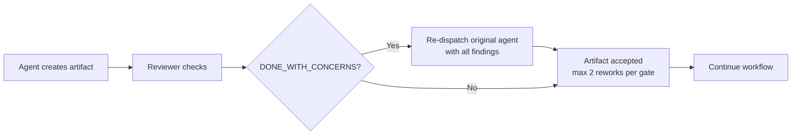
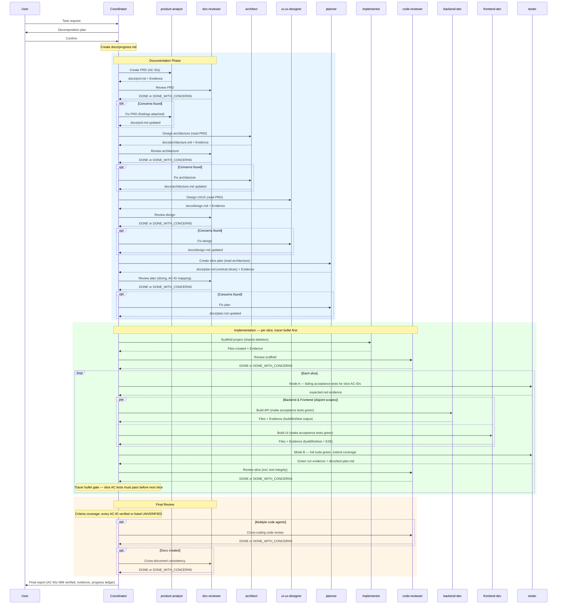
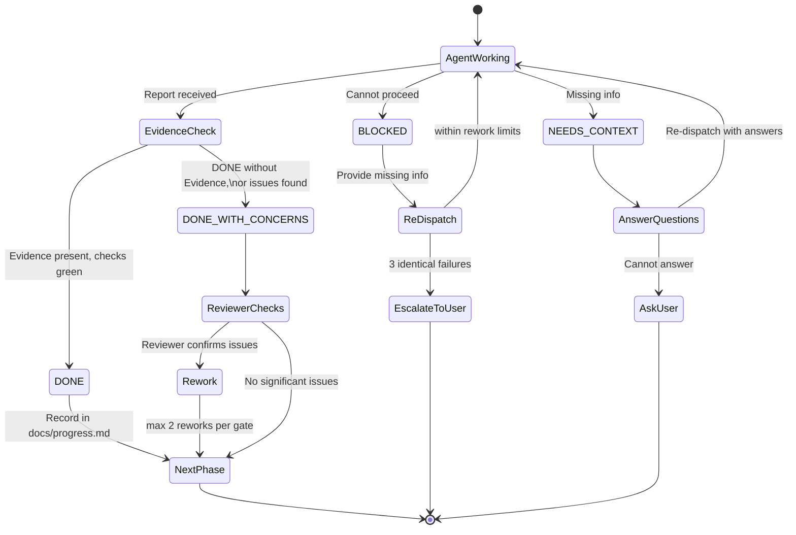

# Dev-Team Workflow

## Overview

The dev-team plugin follows a 5-phase coordinator + specialists architecture. Documents and code are reviewed inline — every artifact is validated immediately after creation, and reworked if issues are found (max 2 rework cycles per artifact per gate; after 3 identical failures the coordinator changes strategy once or escalates to the user).

Core disciplines:
- **Evidence gate**: every agent report must contain an `Evidence` field with fresh command output (or file:line citations for read-only agents). A DONE without Evidence is treated as DONE_WITH_CONCERNS.
- **Vertical slices**: the planner decomposes into end-to-end user paths (tracer bullet first), mapped to PRD acceptance criterion IDs (AC-001...).
- **Tester-first per slice**: tester Mode A writes failing acceptance tests before implementation; implementation agents make them green (but never touch test files); tester Mode B verifies green and extends coverage.
- **Progress ledger**: the coordinator maintains `docs/progress.md` and re-reads it (plus `docs/prd.md`) at every phase and slice start.

## Full Workflow (Greenfield)

```mermaid
flowchart TD
    START([User Request]) --> P1

    subgraph P1["Phase 1: Analysis"]
        A1[Parse task & detect stack]
        A2[Identify agents & decompose subtasks]
        A3[Present plan to user]
        A1 --> A2 --> A3
    end

    P1 --> CONFIRM{User confirms?}
    CONFIRM -- No --> P1
    CONFIRM -- Yes --> LEDGER[Create docs/progress.md]
    LEDGER --> P2

    subgraph P2["Phase 2: Dispatch & Inline Review"]
        direction TB

        subgraph DOC_PHASE["Documentation Phase"]
            direction TB

            PA[product-analyst] -->|docs/prd.md with AC-IDs| DR1
            subgraph DR1["Doc Review: PRD"]
                DR1_R[doc-reviewer]
                DR1_D{Concerns?}
                DR1_R --> DR1_D
                DR1_D -- Yes --> DR1_FIX[re-dispatch product-analyst]
                DR1_FIX --> DR1_OK[PRD ready]
                DR1_D -- No --> DR1_OK
            end

            DR1 --> ARCH[architect]
            ARCH -->|docs/architecture.md| DR2
            subgraph DR2["Doc Review: Architecture"]
                DR2_R[doc-reviewer]
                DR2_D{Concerns?}
                DR2_R --> DR2_D
                DR2_D -- Yes --> DR2_FIX[re-dispatch architect]
                DR2_FIX --> DR2_OK[Architecture ready]
                DR2_D -- No --> DR2_OK
            end

            DR2 --> UI[ui-ux-designer]
            UI -->|docs/design.md| DR3
            subgraph DR3["Doc Review: Design"]
                DR3_R[doc-reviewer]
                DR3_D{Concerns?}
                DR3_R --> DR3_D
                DR3_D -- Yes --> DR3_FIX[re-dispatch ui-ux-designer]
                DR3_FIX --> DR3_OK[Design ready]
                DR3_D -- No --> DR3_OK
            end

            DR3 --> PL[planner]
            PL -->|docs/plan.md: vertical slices| DR4
            subgraph DR4["Doc Review: Plan"]
                DR4_R[doc-reviewer]
                DR4_D{Concerns?}
                DR4_R --> DR4_D
                DR4_D -- Yes --> DR4_FIX[re-dispatch planner]
                DR4_FIX --> DR4_OK[Plan ready]
                DR4_D -- No --> DR4_OK
            end
        end

        DOC_PHASE --> SCAFFOLD

        subgraph SCAFFOLD["Shared Scaffolding"]
            IMP[implementor: skeleton, config, shared types] --> CR1
            subgraph CR1["Code Review: Scaffold"]
                CR1_R[code-reviewer]
                CR1_D{Concerns?}
                CR1_R --> CR1_D
                CR1_D -- Yes --> CR1_FIX[re-dispatch implementor]
                CR1_FIX --> CR1_OK[Scaffold ready]
                CR1_D -- No --> CR1_OK
            end
        end

        SCAFFOLD --> SLICE_LOOP

        subgraph SLICE_LOOP["Per Slice (tracer bullet first)"]
            direction TB
            TA["tester Mode A: failing acceptance tests<br/>(expected-red per AC-ID)"] --> PARALLEL

            subgraph PARALLEL["Parallel Implementation (disjoint scopes)"]
                direction LR
                BE[backend-dev] 
                FE[frontend-dev]
            end

            PARALLEL --> TB2["tester Mode B: full suite green,<br/>extend coverage, update docs/test-plan.md"]
            TB2 --> CRS
            subgraph CRS["Code Review: Slice"]
                CRS_R[code-reviewer]
                CRS_D{Concerns?}
                CRS_R --> CRS_D
                CRS_D -- Yes --> CRS_FIX[re-dispatch responsible agent]
                CRS_FIX --> CRS_OK[Slice done]
                CRS_D -- No --> CRS_OK
            end
            CRS --> GATE{"Slice acceptance tests<br/>pass end-to-end?"}
            GATE -- Yes --> NEXT_SLICE[Next slice]
            GATE -- No --> FIX[re-dispatch within rework limits]
            FIX --> TB2
        end
    end

    P2 --> P3

    subgraph P3["Phase 3: Collection"]
        C0["Evidence gate: DONE without Evidence<br/>= DONE_WITH_CONCERNS"]
        C1[Process agent reports, update docs/progress.md]
        C2{All DONE?}
        C0 --> C1 --> C2
        C2 -- "BLOCKED / NEEDS_CONTEXT" --> C3[Re-dispatch with info]
        C3 --> C1
        C2 -- Yes --> C4[Proceed]
    end

    P3 --> P4

    subgraph P4["Phase 4: Final Review"]
        direction TB
        F0["Criteria coverage check:<br/>every AC-ID has passing evidence<br/>or is listed UNVERIFIED"]
        F0 --> F1{Multiple code agents?}
        F1 -- Yes --> F2[code-reviewer: cross-cutting review + test integrity]
        F2 --> F2D{Concerns?}
        F2D -- Yes --> F2FIX[re-dispatch code agent]
        F2FIX --> F3
        F2D -- No --> F3
        F1 -- No --> F3

        F3{Docs created?}
        F3 -- Yes --> F4[doc-reviewer: cross-doc consistency]
        F4 --> F4D{Concerns?}
        F4D -- Yes --> F4FIX[re-dispatch doc agent]
        F4FIX --> F5[Review complete]
        F4D -- No --> F5
        F3 -- No --> F5
    end

    P4 --> P5

    subgraph P5["Phase 5: Report"]
        R1[Compile summary]
        R2["AC-IDs verified N/M + files changed<br/>+ test evidence + concerns"]
        R3[Link docs/progress.md + next steps]
        R1 --> R2 --> R3
    end

    P5 --> DONE([Done])
```

## Review Loop Pattern

Every artifact (document or code) follows the same review-and-rework pattern:

```mermaid
flowchart LR
    AGENT[Agent creates artifact] --> REVIEWER[Reviewer checks]
    REVIEWER --> D{DONE_WITH_CONCERNS?}
    D -- Yes --> REWORK[Re-dispatch original agent\nwith all findings]
    REWORK --> PASS[Artifact accepted\nmax 2 reworks per gate]
    D -- No --> PASS
    PASS --> NEXT[Continue workflow]
```

| Artifact type | Creator agents | Reviewer | Rework limit |
|---|---|---|---|
| PRD | product-analyst | doc-reviewer | 2 |
| Architecture | architect | doc-reviewer | 2 |
| Design spec | ui-ux-designer | doc-reviewer | 2 |
| Execution plan | planner | doc-reviewer | 2 |
| Scaffold code | implementor | code-reviewer | 2 |
| Backend code | backend-dev | code-reviewer | 2 |
| Frontend code | frontend-dev | code-reviewer | 2 |
| Test code | tester | code-reviewer | 2 |

After 3 identical failure signatures: change strategy once (different agent, narrower scope, split the task) or escalate to the user with the full attempt history.

## Agent Dispatch Order

```mermaid
sequenceDiagram
    participant U as User
    participant C as Coordinator
    participant PA as product-analyst
    participant DR as doc-reviewer
    participant AR as architect
    participant UD as ui-ux-designer
    participant PL as planner
    participant IM as implementor
    participant CR as code-reviewer
    participant BE as backend-dev
    participant FE as frontend-dev
    participant TE as tester

    U->>C: Task request
    C->>U: Decomposition plan
    U->>C: Confirm
    Note over C: Create docs/progress.md

    rect rgb(230, 245, 255)
        Note over C,DR: Documentation Phase
        C->>PA: Create PRD (AC-IDs)
        PA-->>C: docs/prd.md + Evidence
        C->>DR: Review PRD
        DR-->>C: DONE or DONE_WITH_CONCERNS
        opt Concerns found
            C->>PA: Fix PRD (findings attached)
            PA-->>C: docs/prd.md updated
        end

        C->>AR: Design architecture (read PRD)
        AR-->>C: docs/architecture.md + Evidence
        C->>DR: Review architecture
        DR-->>C: DONE or DONE_WITH_CONCERNS
        opt Concerns found
            C->>AR: Fix architecture
            AR-->>C: docs/architecture.md updated
        end

        C->>UD: Design UI/UX (read PRD)
        UD-->>C: docs/design.md + Evidence
        C->>DR: Review design
        DR-->>C: DONE or DONE_WITH_CONCERNS
        opt Concerns found
            C->>UD: Fix design
            UD-->>C: docs/design.md updated
        end

        C->>PL: Create slice plan (read architecture)
        PL-->>C: docs/plan.md (vertical slices) + Evidence
        C->>DR: Review plan (slicing, AC-ID mapping)
        DR-->>C: DONE or DONE_WITH_CONCERNS
        opt Concerns found
            C->>PL: Fix plan
            PL-->>C: docs/plan.md updated
        end
    end

    rect rgb(230, 255, 230)
        Note over C,CR: Implementation — per slice, tracer bullet first
        C->>IM: Scaffold project (shared skeleton)
        IM-->>C: Files created + Evidence
        C->>CR: Review scaffold
        CR-->>C: DONE or DONE_WITH_CONCERNS

        loop Each slice
            C->>TE: Mode A — failing acceptance tests for slice AC-IDs
            TE-->>C: expected-red evidence

            par Backend & Frontend (disjoint scopes)
                C->>BE: Build API (make acceptance tests green)
                BE-->>C: Files + Evidence (build/lint/test output)
            and
                C->>FE: Build UI (make acceptance tests green)
                FE-->>C: Files + Evidence (build/lint/test + E2E)
            end

            C->>TE: Mode B — full suite green, extend coverage
            TE-->>C: Green run evidence + docs/test-plan.md
            C->>CR: Review slice (incl. test integrity)
            CR-->>C: DONE or DONE_WITH_CONCERNS
            Note over C: Tracer bullet gate — slice AC tests must pass before next slice
        end
    end

    rect rgb(255, 245, 230)
        Note over C,DR: Final Review
        Note over C: Criteria coverage: every AC-ID verified or listed UNVERIFIED
        opt Multiple code agents
            C->>CR: Cross-cutting code review
            CR-->>C: DONE or DONE_WITH_CONCERNS
        end
        opt Docs created
            C->>DR: Cross-document consistency
            DR-->>C: DONE or DONE_WITH_CONCERNS
        end
    end

    C->>U: Final report (AC-IDs N/M verified, evidence, progress ledger)
```

## Status Handling

```mermaid
stateDiagram-v2
    [*] --> AgentWorking

    AgentWorking --> EvidenceCheck: Report received
    EvidenceCheck --> DONE: Evidence present, checks green
    EvidenceCheck --> DONE_WITH_CONCERNS: DONE without Evidence,\nor issues found
    AgentWorking --> BLOCKED: Cannot proceed
    AgentWorking --> NEEDS_CONTEXT: Missing info

    DONE --> NextPhase: Record in docs/progress.md
    DONE_WITH_CONCERNS --> ReviewerChecks
    ReviewerChecks --> Rework: Reviewer confirms issues
    Rework --> NextPhase: max 2 reworks per gate
    ReviewerChecks --> NextPhase: No significant issues

    BLOCKED --> ReDispatch: Provide missing info
    ReDispatch --> AgentWorking: within rework limits
    ReDispatch --> EscalateToUser: 3 identical failures

    NEEDS_CONTEXT --> AnswerQuestions
    AnswerQuestions --> AgentWorking: Re-dispatch with answers
    AnswerQuestions --> AskUser: Cannot answer

    NextPhase --> [*]
    EscalateToUser --> [*]
    AskUser --> [*]
```
